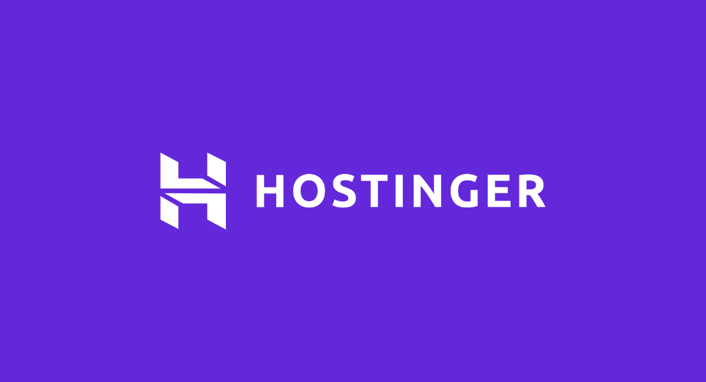

# Manu Siqueira Estética Avançada

  

  
  
  
  
  
  
  

###

###

> Landing page que desenvolvi para uma freelancer, empresa de tratamento estético, a cliente solicitou uma página elegante, com cores chamativas e que mostrasse sobre ela e sua empresa, seus serviços e produtos, fazendo com que seus clientes se sentissem confortáveis ​​clicando nos links ligue para ação, contato direto via WhatsApp.

## 💻 Um pouco do projeto

## ⭐ Metas

- [x] Uma página viva e elegante
- [x] Mostrar a equipe e serviços da empresa
- [x] Design Responsivo
- [x] Transformar usuários em Leads
- [x] Levar usuários ao contato com a empresa

## 🔗 Hospedagem

<strong>Hostinger</strong> é conhecida por oferecer planos de hospedagem acessíveis, com preços competitivos, o que é ideal para startups, pequenas empresas e projetos pessoais, por isso , foi a minha escolha para hospedagem

Os servidores da Hostinger são otimizados para desempenho, o que resulta em tempos de carregamento rápidos para os sites

> Clique na imagem e acesse o projeto

## Imagens utilizadas

Algumas imagens precisam ser utilizadas para complementar o conteúdo do site, todas são atribuídas aos seus criadores

## 🤓 Me acompanhe para mais projetos
